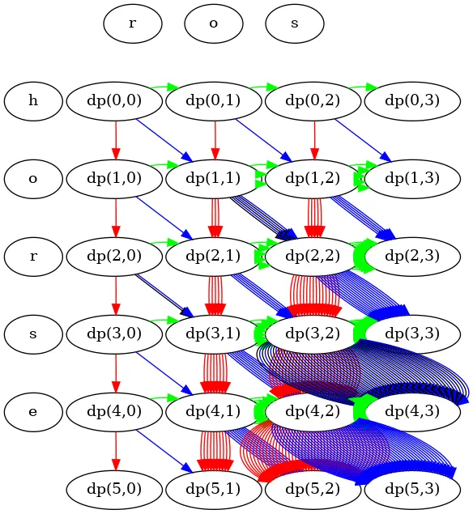
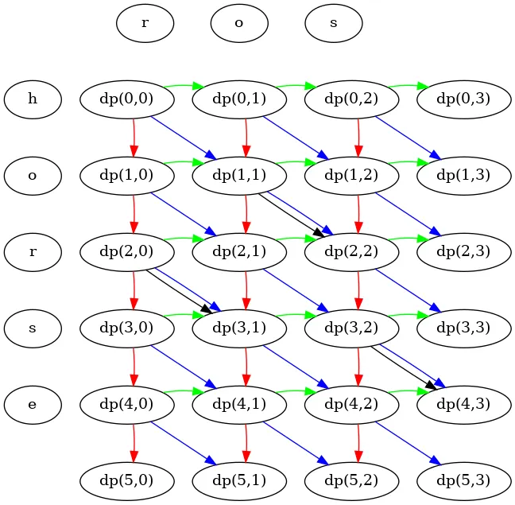

**Series:**

- [Dynamic programming is simple]()
- Dynamic programming is simple #2 (this article)
- [Dynamic programming is simple #3 (multi-root recursion)]()
- [Dynamic programming is simple #4 (bitmap + optimal solution reconstruction)]()

In the [previous article]() I explained how to solve DP problems with the easiest example. In this article, I want to go through the template I've given before to solve a more complicated problem.

The problem is the following: [Edit Distance](https://leetcode.com/problems/edit-distance/). This one is quite famous, so you likely have already seen it (or will see).

Let's try to follow our script again (assuming we have already determined this is a DP problem from the description).

## What do we do at each step

Task description says it clearly.

We either:

- Insert a character
- Delete a character
- Replace a character
- Keep the character (in case it matches the character from the second word)

## What does it mean in terms of recursive function?

Let's say we have two pointers pointing to positions in each string. We again assume that the current state is correct, so we don't care for now how we ended up here.

Let's consider an example:

```
h o r s e
    ^- ptr1
r o s
  ^- ptr2
```

Characters under the pointers do not match. So we have the following options:

- **Insert:** insert "o" character before "r" => first pointer does not move, second pointer moves 1 position to the right
- **Delete:** delete "r" => first pointer moves 1 position to the right, second does not move
- **Replace:** replace "r" by "o" => both pointers move 1 position to the right

Let's illustrate it another way, so it will be simpler to understand.

**Insert** (virtual "o" inserted, so the characters now match, move the second pointer to continue matching process)

```
h o r s e       h o [o] r s e
    ^       ->      ^
r o s           r o s
  ^                 ^
```

**Delete** ("r" is virtually deleted, move the first pointer)

```
h o r s e       h o _ s e
    ^       ->      ^
r o s           r o s
  ^               ^
```

**Replace** (replace "r" by "o", so we have a match and can move both pointers)

```
h o r s e       h o o s e
    ^       ->      ^
r o s           r o s
  ^               ^
```

So now that you get the idea, we can quickly write the recursive function skeleton that performs those operations. I'll remind you again that we do not care about the correctness of our solution at this stage. We build the foundation for the solution to think only of one thing at any given moment. You can think of it as a higher level of abstraction if you wish.

```python
def dp(ptr1: int, ptr2: int) -> None:
    # Insert
    dp(ptr1, ptr2 + 1)

    # Delete
    dp(ptr1 + 1, ptr2)

    # Replace
    dp(ptr1 + 1, ptr2 + 1)
```

I generally prefer going through tasks layer by layer like this. Now you know for sure your set of recursive calls is perfectly correct. So you do not need to return to that anymore. You just add the missing layers on the top.

## Construct the next optimal solution from the subsequent recursive calls

Here we need to add two extensions to our code:

- Given the results of all subsequent recursive calls and assuming they are correct, construct the optimal solution for this set of arguments.
- Add base case(s) to complete the solution and make it valid (by [mathematical induction](https://en.wikipedia.org/wiki/Mathematical_induction)).

First, let's notice that when we perform insert/delete/replace operations, we increase an edit distance by one. And if we have a match, edit distance stays the same. Given that, we can construct the next optimal solution like that (no base case yet):

```python
def dp(ptr1: int, ptr2: int) -> int:
    min_dist = float('inf')

    # Insert
    min_dist = min(min_dist, dp(ptr1, ptr2 + 1) + 1)

    # Delete
    min_dist = min(min_dist, dp(ptr1 + 1, ptr2) + 1)

    # Replace or Match
    if word1[ptr1] == word2[ptr2]:
        # Match - no cost
        min_dist = min(min_dist, dp(ptr1 + 1, ptr2 + 1))
    else:
        # Replace - cost of 1
        min_dist = min(min_dist, dp(ptr1 + 1, ptr2 + 1) + 1)

    return min_dist
```

We can make this code shorter, but I'll leave it verbose for the sake of comprehensibility.

The code above must make perfect sense to you if you have been following my description so far.

Now let's think about the base cases. There are two of them here:

- `ptr1` runs over the `word1` length.
- `ptr2` runs over the `word2` length.

In the first case, we can either:

- Insert the same characters as left in `word2` after `ptr2` into `word1`.
- Delete the rest of the characters from `word1` (all characters after `ptr1`).

For the second case, we do the same but another way around.

With those base cases, the code will look like this:

```python
class Solution:
    def minDistance(self, word1: str, word2: str) -> int:
        def dp(ptr1: int, ptr2: int) -> int:
            # Base cases
            if ptr1 >= len(word1):
                # Insert remaining characters from word2
                return len(word2) - ptr2

            if ptr2 >= len(word2):
                # Delete remaining characters from word1
                return len(word1) - ptr1

            min_dist = float('inf')

            # Insert
            min_dist = min(min_dist, dp(ptr1, ptr2 + 1) + 1)

            # Delete
            min_dist = min(min_dist, dp(ptr1 + 1, ptr2) + 1)

            # Replace or Match
            if word1[ptr1] == word2[ptr2]:
                # Match - no cost
                min_dist = min(min_dist, dp(ptr1 + 1, ptr2 + 1))
            else:
                # Replace - cost of 1
                min_dist = min(min_dist, dp(ptr1 + 1, ptr2 + 1) + 1)

            return min_dist

        return dp(0, 0)
```

And once again, we got a valid backtracking solution. This solution gives the correct answer. However, it is suboptimal. Let's check its call graph.



**Legend:**

- Green: Insert
- Red: Delete
- Blue: Replace
- Black: Match

As you see, there are lots of duplicating calls again.

## Top-Down DP solution

This part is fairly straightforward in Python, as you remember from the previous article. Just add the `lru_cache` decorator.

```python
from functools import lru_cache

class Solution:
    def minDistance(self, word1: str, word2: str) -> int:
        @lru_cache(None)
        def dp(ptr1: int, ptr2: int) -> int:
            # Base cases
            if ptr1 >= len(word1):
                return len(word2) - ptr2

            if ptr2 >= len(word2):
                return len(word1) - ptr1

            min_dist = float('inf')

            # Insert
            min_dist = min(min_dist, dp(ptr1, ptr2 + 1) + 1)

            # Delete
            min_dist = min(min_dist, dp(ptr1 + 1, ptr2) + 1)

            # Replace or Match
            if word1[ptr1] == word2[ptr2]:
                min_dist = min(min_dist, dp(ptr1 + 1, ptr2 + 1))
            else:
                min_dist = min(min_dist, dp(ptr1 + 1, ptr2 + 1) + 1)

            return min_dist

        return dp(0, 0)
```

The call graph for the Top-Down solution looks much better!



Also, as you see, the recursive calls form a nice grid. I made it like this to highlight that we can build a table to cache all the results of the recursive calls. I hope it is obvious if you look at the illustration above.

## Bottom-Up solution

Now only the last part is left. We want to construct a Bottom-Up solution. Let's use the set of rules from the previous article.

```python
class Solution:
    def minDistance(self, word1: str, word2: str) -> int:
        dp = [[0] * (len(word2) + 1) for _ in range(len(word1) + 1)]

        # Initialize base cases
        for ptr1 in range(len(word1) + 1):
            dp[ptr1][len(word2)] = len(word1) - ptr1

        for ptr2 in range(len(word2) + 1):
            dp[len(word1)][ptr2] = len(word2) - ptr2

        # Fill the table
        for ptr1 in range(len(word1) - 1, -1, -1):
            for ptr2 in range(len(word2) - 1, -1, -1):
                min_dist = float('inf')

                # Insert
                min_dist = min(min_dist, dp[ptr1][ptr2 + 1] + 1)

                # Delete
                min_dist = min(min_dist, dp[ptr1 + 1][ptr2] + 1)

                # Replace or Match
                if word1[ptr1] == word2[ptr2]:
                    min_dist = min(min_dist, dp[ptr1 + 1][ptr2 + 1])
                else:
                    min_dist = min(min_dist, dp[ptr1 + 1][ptr2 + 1] + 1)

                dp[ptr1][ptr2] = min_dist

        return dp[0][0]
```

The only tricky thing here is determining the order in which we go over `ptr1` and `ptr2` values. But it becomes quite apparent when you look at the call graph from the previous section. Also, if you look at the `dp` function calls in the code, you can see the same. It takes practice to choose the traversal order correctly, but as you can see, it is not that complicated.

## Bottom-Up (optimized)

There is a way to optimize the code further memory-wise. While calculating the values for the row, you might notice that we need only a row below. So we can rewrite the code, so it will have O(N) complexity, where N is the length of the second word.

```python
class Solution:
    def minDistance(self, word1: str, word2: str) -> int:
        # We only need the current and next row
        dp = [0] * (len(word2) + 1)

        # Initialize base case for last row
        for ptr2 in range(len(word2) + 1):
            dp[ptr2] = len(word2) - ptr2

        # Fill the table
        for ptr1 in range(len(word1) - 1, -1, -1):
            dp_old = dp[:]
            dp[len(word2)] = len(word1) - ptr1

            for ptr2 in range(len(word2) - 1, -1, -1):
                min_dist = float('inf')

                # Insert
                min_dist = min(min_dist, dp[ptr2 + 1] + 1)

                # Delete
                min_dist = min(min_dist, dp_old[ptr2] + 1)

                # Replace or Match
                if word1[ptr1] == word2[ptr2]:
                    min_dist = min(min_dist, dp_old[ptr2 + 1])
                else:
                    min_dist = min(min_dist, dp_old[ptr2 + 1] + 1)

                dp[ptr2] = min_dist

        return dp[0]
```

Once again, I have just slightly modified the code, to use `dp_old` instead of `dp[ptr1 + 1]` (next line effectively) and `dp` instead of `dp[ptr1]` (same line).

## Final thoughts

Now you see the same script applies to other problems as well. Try practicing it yourself, and you'll notice the pattern.

Problem-solving skill is all about noticing patterns. You see a new problem description, but at the same time, you realize that we can reduce this problem down to taking action each step and finding a minimum or maximum on each step. Then you remember how you solved similar problems and then use the same technique we described here for the new one.

The same thing happens, for example, when you realize we can transform the problem to the problem of finding the shortest path in a graph. In this case, you use Dijkstra (which you already know).

Problem-solving is the ability to recognize the problem you have already seen and know how to solve (or a combination of them) behind the vague description.

This was a typical DP problem (with a 2-dimensional table, instead of the Nx2 table we used last time). There are 3-dimensional "tables" as well, and even 4-dimensional. But the idea is the same. You get a recursive function with 3 or 4 arguments with a limited set of values, and you just cache the recursive calls in that "table". So it is not that different from the case with just two arguments we've seen today.

In the following articles, I will show you techniques, which diverge a little bit from the ones we've seen before. Even though the idea remains the same, if you blindly apply the template from the previous article, you will probably get stuck because it will not work. But those "special cases" are only about 10% of the problems, and you can already solve 90% of them. It is time to celebrate that. Do not forget to treat yourself for learning hard. Get some rest, get some coffee, walk in the park, meet your friends.

Stay tuned!

(more solved problems are available at [github.com/fspv/learning](http://github.com/fspv/learning))

---

_This article is also available on [Medium](https://medium.com/@pv.safronov/dynamic-programming-is-simple-2-32147f45d525)._
