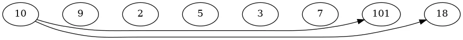
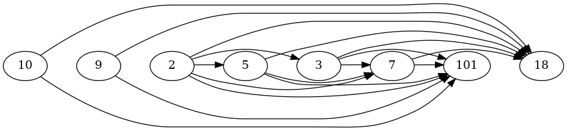

**Series:**

- [Dynamic programming is simple]()
- [Dynamic programming is simple #2]()
- Dynamic programming is simple #3 (multi-root recursion) (this article)
- [Dynamic programming is simple #4 (bitmap + optimal solution reconstruction)]()

Now that you have got the idea, let's look at one problem that does not fit the pattern if you apply it blindly.

The solution to the problem I am about to show you might seem obvious to many of you if you followed the previous article. However, I have seen people who got stuck here because of a simple nuance.

## The problem

We are about to discuss this problem: [Longest Increasing Subsequence](https://leetcode.com/problems/longest-increasing-subsequence/)

This one is one of the classic DP examples. It is relatively easy, so people already familiar with DP should come up with the solution almost immediately.

## First attempt

Let's try to write down the solution using the pattern we already know.

I will point out that the solution below is incorrect. Still, this is a solution I often see people implement and struggle to understand why it doesn't work.

I will implement the top-down solution because it is simpler to see how the answer is formed that way.

```python
from functools import lru_cache

class Solution:
    def lengthOfLIS(self, nums: List[int]) -> int:
        @lru_cache(None)
        def dp(pos: int) -> int:
            if pos >= len(nums):
                return 0

            max_length = 1  # Current element counts as a subsequence of length 1

            # Try to pick the next element
            for next_pos in range(pos + 1, len(nums)):
                if nums[next_pos] > nums[pos]:
                    max_length = max(max_length, dp(next_pos) + 1)

            return max_length

        return dp(0)  # INCORRECT: Only considers subsequences starting at index 0
```

Everything looks fine here. We have defined what we do at each step (try to pick the next element in the array and add it to the existing subsequence), each step is valid, and the recursion itself is correct. So there is nothing wrong with recursion. Still, when we run this solution, it does not work. What is wrong here?

Many of you have already noticed the problem. **The problem is that we consider only a subsequence that includes the first element of the `nums` array.**

Let's check the call graph to illustrate it better.



I hope it is clear now that by calling only `dp(0)`, we are missing calling `dp()` at many other positions. We only call it for those positions, reachable from `dp(0)`.

This is where it diverges slightly from the initial pattern. Earlier, for all the solutions to seed the recursion, we needed only to call `dp()` from some initial position (day 0 for "buying and selling stocks", and for edit distance, we just put pointers at position 0 in both strings). This case is different because of how we defined the recursion step. That needs to be fixed from outside the recursive call.

## Correct solution

You might already have come up with the fix, so I will just write the correct solution down.

```python
from functools import lru_cache

class Solution:
    def lengthOfLIS(self, nums: List[int]) -> int:
        @lru_cache(None)
        def dp(pos: int) -> int:
            if pos >= len(nums):
                return 0

            max_length = 1  # Current element counts as a subsequence of length 1

            # Try to pick the next element
            for next_pos in range(pos + 1, len(nums)):
                if nums[next_pos] > nums[pos]:
                    max_length = max(max_length, dp(next_pos) + 1)

            return max_length

        # CORRECT: Check all possible starting positions
        result = 0
        for start_pos in range(len(nums)):
            result = max(result, dp(start_pos))

        return result
```

Now we check all possible starting positions, and this gives us a correct answer.

Let's check a new call graph.



Hooray! It works.

Let's try to write a bottom-up solution as well using the well-known set of transformation rules.

```python
class Solution:
    def lengthOfLIS(self, nums: List[int]) -> int:
        if not nums:
            return 0

        # dp[i] represents the length of longest increasing subsequence ending at index i
        dp = [1] * len(nums)

        # Fill the table from right to left
        for pos in range(len(nums) - 1, -1, -1):
            for next_pos in range(pos + 1, len(nums)):
                if nums[next_pos] > nums[pos]:
                    dp[pos] = max(dp[pos], dp[next_pos] + 1)

        # Return the maximum value from all positions
        return max(dp)
```

And now we are done. Time to celebrate another solved DP problem.

## Final thoughts

We have just completed a one-dimensional example. Some multi-dimensional problems require the same technique. The general idea is that not all nodes in the DP table are always reachable from a single location. So the call graph is not a tree anymore as it was for the previous problems. Instead, it is a **multi-root tree**. To construct a solution, you should make queries from every possible tree root and choose the best results for a given problem statement. So one more step is added to your solution.

I am not giving you the list of such problems intentionally. You should be able to recognize them yourself.

That is it for now. In the following article, I will show how bitmasks might be helpful for DP problems. Stay tuned.

(more solved problems are available at [github.com/fspv/learning](http://github.com/fspv/learning))

---

_This article is also available on [Medium](https://medium.com/@pv.safronov/dynamic-programming-is-simple-3-multi-root-recursion-c613dfcc15b4)._
