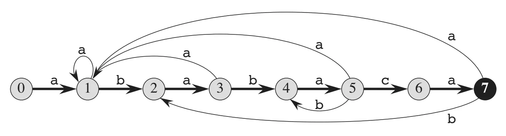
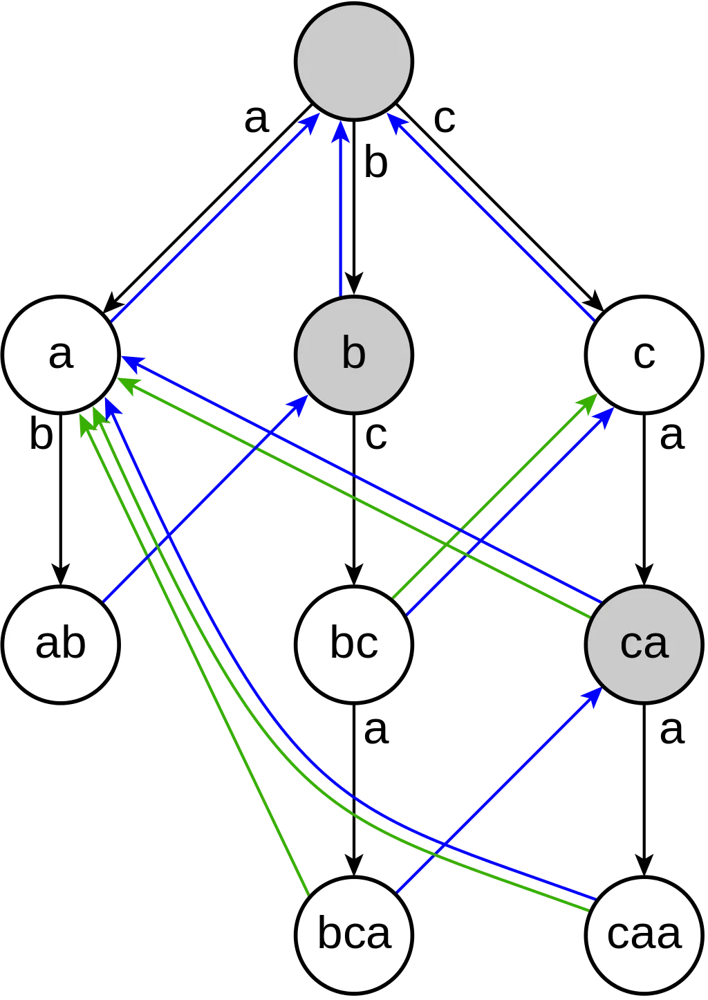

This article is for people who're already familiar with algorithm basics and have at least heard about string-matching algorithms but are still a bit scared of them.

## Introduction

(it's safe to skip to the next section)

When we think about string-matching algorithms, we tend to treat them the way we usually treat sorting algorithms. Like why the hell do I need to know how they work? As long it is `O(N log N)`, why would I care?

There is one thing, though. Even though I'd argue this reasoning is correct if you think about direct applications of those, sometimes it is more than just that. If you need to sort an array, you'll call a `sort()` method from the STL of your language, which will be enough. But think about a situation when you need to perform an on-disk sort, in which case you need to know why merge sort is the best for this purpose. Or, for example, if you need to find the p80 percentile (the typical use case for monitoring), then you better know how quicksort works.

Knowing those algorithms' details is exciting and sometimes useful, and string-matching algorithms are no exception. This article will give you some pieces that helped me understand those algorithms better and made me less scared of them. Also, I'll show you some applications of those to some leetcode problems, which are hard to identify as string matching when you first look at them. Although I'll warn you straight away, that is not a comprehensive guide for string algorithms, just some pieces I think are missing from the public domain.

We'll start with the Rabin-Karp algorithm, which is the simplest one. KMP will follow. And I'll also briefly touch on Aho-Corasick, but its implementation is where things get cumbersome, so I'll leave its detailed description for better times. Though the first two algorithms are super easy to implement and think about, which is what I'm about to show.

NOTE: if you want to test your implementation of any string-matching algorithm, you can use this leetcode problem [https://leetcode.com/problems/implement-strstr/](https://leetcode.com/problems/implement-strstr/)

## Rabin-Karp

Assuming you already know the idea behind the algorithm (or at least can get familiar with it at Wikipedia), I'll show you the implementation, followed by examples of the application of the idea.

When I'm using python, I like to implement the rolling hash as an object with two methods:

- `append(char: str)` - to add a new character to the right
- `popleft()` - to remove a character from the left

Here is a sample implementation.

```python
class RollingHash:
    def __init__(self, string: str) -> None:
        self._hash = 0
        self._chars = 0
        self._alphabet_size = 26

        for char in string:
            self.append(char)

    @staticmethod
    def _char_to_int(char: str) -> int:
        return ord(char) - ord("a") + 1

    def append(self, char: str) -> None:

        self._chars += 1
        self._hash = self._hash * self._alphabet_size + self._char_to_int(char)

    def popleft(self) -> None:
        self._chars -= 1
        self._hash %= self._alphabet_size ** self._chars

    def __eq__(self, other: object) -> bool:
        return isinstance(other, RollingHash) and self._hash == other._hash
```

So now you can change those hashes as you wish and compare them.

For example:

```python
string_hash = RollingHash("abc")
pattern_hash = RollingHash("bcd")
```

```python
string_hash == pattern_hash


string_hash.append("d")
string_hash.popleft()

string_hash == pattern_hash
```

This approach gives you an important advantage during the coding interview. You can quickly define an interface and start using it immediately, while the actual implementation can be postponed, saving precious interview time for what matters more.

An example implementation of the Rabin-Karp algorithm using this hash object looks like this:

```python
def first_match(string: str, pattern: str) -> int:
    string_hash = RollingHash(string[: len(pattern) - 1])
    pattern_hash = RollingHash(pattern)

    for end in range(len(pattern) - 1, len(string)):
        start = end - len(pattern) + 1

        string_hash.append(string[end])

        if string_hash == pattern_hash:

            if string[start : end + 1] == pattern:
                return start

        string_hash.popleft()

    return -1
```

## Rabin-Karp applications

Now assuming we already have a rolling hash implementation, let's check out how it might be helpful to match the pattern against a string in `O(n)` (best case) time.

## Longest repeating substring

One common application for string matching algorithms is finding the [longest repeating substring](https://leetcode.com/problems/longest-repeating-substring/).

It might not look obvious how exactly this is useful. The bruteforce algorithm is `O(n^3)`, but having a string-matching algorithm will allow us to do better.

One data point here is that given that we have no collisions, we can match 2 subarrays in `O(n)` time.

Another helpful insight here is that if we construct all the possible substrings, it makes sense to match only between 2 of similar length. So if we do exactly that, the problem of finding if there exists a repeating substring of a certain length is solved. And here is how the distribution of those solutions might look like for some arbitrary string of length 10:

```
|     lenght     |  0   |  1   |  2   |   3   |   4   |   5   |   6   |   7   |   8   |   9   |
| has repeating? | True | True | True | False | False | False | False | False | False | False |
```

So we see it is a monotonic function, so we can use binary search to find a length where the `True` series ends.

Given all of that, we can come up with a combination of string matching and binary search to design an `O(N log N)` algorithm.

If it is still unclear, I suggest referring to the problem description and going through my explanation a few more times. I intentionally don't dive too deeply into a particular problem because this is not the article's intention.

## Shortest palindrome

Another problem, which requires a slight modification of our previous hash interface, is finding the shortest palindrome in the string [https://leetcode.com/problems/shortest-palindrome/](https://leetcode.com/problems/shortest-palindrome/).

That is a very interesting problem, where the idea for the solution is quite simple. Try to think about the problem yourself before moving forward. The following paragraph will contain a spoiler; I warned you.

This problem comes down to a very simple idea: we must match a string onto a reversed version of itself. Once we found the longest match — we're done.

```
[ ------- non-reversed string ------ ]
          [         palindrome       ]
[ --------  reversed string -------- ]
```

The answer will be a matched part (palindrome, since reversed version matched the non-reversed one) + non-matched part and reversed non-matched part.

Basically like this:

```
(reversed non-matched) -- (palindrome) -- (non-matched)
[ -------- reversed string --------- ]
```

Now you got this simple idea, the only thing left is how the hell do we match non-reversed and reversed strings efficiently? Well, if only we could shift reversed string one position at a time along non-reversed one and incrementally compare overlapping parts… Wait, we can already do that. Rabin-Karp allows us to add one element at a time to the hash. So we can grow each hash 1 item at a time and compare those with each other.

The only catch here is that we grow reversed string right to left and a non-reversed one left to right. The latter we can do already with the `append(char)` method, the former we can't yet. But it is easy to fix by implementing an`appendleft(char)` method:

```python
def appendleft(self, char: str) -> None:
        self._hash = int(
            self._hash + self._char_to_int(char) * (self._alphabet_size ** self._chars)
        ) % self._mod
        self._chars += 1
```

Now we have that, the longest palindrome function becomes quite easy to implement:

```python
def longest_palindrome_from_beginning(target: str) -> int:

    hash_left_right = RollingHash("")

    hash_right_left = RollingHash("")

    longest_palindrome = 0

    for pos in range(len(target)):
        hash_left_right.append(target[pos])
        hash_right_left.appendleft(target[pos])

        if hash_left_right == hash_right_left:
            if list(target[:pos + 1]) == list(reversed(target[:pos + 1])):
                longest_palindrome = pos + 1

    return longest_palindrome
```

And now we have all the API methods we need, the solution will look as simple as

```python
def shortest_palindrome_rabin_karp(target: str) -> str:
    reversed_target = "".join(list(reversed(list(target))))

    length = longest_palindrome_from_beginning(target)

    offset = len(target) - length

    return reversed_target + (target[-offset:] if offset > 0 else "")
```

That's it.

If you want more practice with this method, there is a very similar problem: [Longest Happy Prefix](https://leetcode.com/problems/longest-happy-prefix/). Try solving it yourself. Though, Rabin-Karp is not the most efficient method to solve this problem due to possible collisions, so your solution will most likely time out.

## Other

A couple of other problems which can be most efficiently solved with the Rabin-Karp algorithm:

- [https://leetcode.com/problems/binary-string-with-substrings-representing-1-to-n/](https://leetcode.com/problems/binary-string-with-substrings-representing-1-to-n/)
- [https://leetcode.com/problems/repeated-string-match/](https://leetcode.com/problems/repeated-string-match/)

They require a bit of imagination to come up with the right solution.

For example, look at how easy the solution for the second problem becomes with our RabinKarp implementation:

```python
class Solution:
    def repeatedStringMatch(self, a: str, b: str) -> int:
        a_hash = RollingHash("".join([a[pos % len(a)] for pos in range(len(b))]))
        b_hash = RollingHash(b)

        right = len(b)
        for left in range(len(a)):
            if a_hash == b_hash:
                if "".join([a[pos % len(a)] for pos in range(left, right)]) == b:
                    return right // len(a) + int(right % len(a) > 0)

            a_hash.append(a[right % len(a)])
            a_hash.popleft()

            right += 1

        return -1
```

I'll let you think about the solution as an exercise, and in the meanwhile, we'll move to our next topic, the KMP algorithm.

## KMP

As with the previous chapter, I'll leave you with Wikipedia to familiarise yourself with an algorithm if you haven't done so already. Our goal is not to learn the basics but rather learn about less straightforward applications and try to make more sense of the implementation.

KMP algorithm is where I always found myself freaked out when dealing with it. The idea is so hard to make sense of, so when you think you finally got it in the very next moment, whoops, and it's gone.

So instead of struggling to memorize the concept every time, I chose a different approach. I'm thinking of it more in the way, like, what if I get this problem during the interview? How do I implement it fast?

Here are a few simple ideas about the algorithm, which you have to understand, and which help with the implementation. I'll try to lay it out here, but they will not necessarily all make sense immediately. So if you find yourself struggling, go through a few examples yourself. Without practice, all you read here will not be helpful.

So the first idea is the expression "**the prefix, which is also a suffix**" of the string. That is the most important thing and the key to understanding the whole algorithm.

For example, let's look at the string.

```
abcqweatabiopabc
^^^          ^^^
```

It's easy to notice that `abc` is a prefix of this string, which is also a suffix. That is a very simple idea. Remember it, and let's move further.

Now there is something called a prefix function, which is calculated over the pattern to match the target string for. Let's look at the implementation:

```python
def compute_prefix_function(pattern: str) -> List[int]:
    prefix_function = [0] * len(pattern)

    matched = 0
    for prefix in range(1, len(pattern)):
        while matched != 0 and pattern[prefix] != pattern[matched]:
            matched = prefix_function[matched - 1]

        if pattern[prefix] == pattern[matched]:
            matched += 1

        prefix_function[prefix] = matched

    return prefix_function
```

If you spend some time looking at the code, you'll understand that we try to match a pattern on itself here. Like when target == pattern. And each time, we store a number in the `prefix_function` array that represents how many initial characters have been matched for each offset of the pattern over itself. Let's use the previous example to get some more insights.

```
abcqweatabiopabc
             abcqweatabiopabc
             ^^^
```

See how a prefix, which is also a suffix, might be helpful?

Though how is it related to this prefix function?

In the last example, the offset, where we have matching characters, is not the only one possible. Let's find some more:

```
abcqweatabiopabc
      abcqweatabiopabc
      ^
```

So for substring `abcqwea` we have \`a', which is a prefix, which is also a suffix.

And another one

```
abcqweatabiopabc
        abcqweatabiopabc
        ^^
```

`ab` is a prefix, which is also a suffix for `abcqweatab`

And so on. So prefix function is a representation of this idea, how long for this particular substring is the largest prefix, which is also a suffix.

Also, it is worth noticing that if we match the pattern against some substring and the match fails, it is most beneficial to shift the pattern towards a first position, where the prefix, which is also a suffix, starts because there is no way to match at other positions. So basically, we might imagine the whole thing like a graph, where if there is no match, we jump to another node to try another possible match.

The code above makes less sense, though than the idea itself. It becomes clear after some time spent looking at the code, but I'd rather memorize it; it is 8 lines of code anyway.

At this point, we already have a good algorithm to match the pattern on itself, which makes a lot of sense now. Let's extend it to match some arbitrary string using this prefix function instead.

I'll throw some code at you right away, and hopefully, you will notice something very interesting immediately.

```python
def first_match(target: str, pattern: str) -> int:
    prefix_function = compute_prefix_function(pattern)

    matched = 0
    for pos in range(len(target)):
        while matched != 0 and target[pos] != pattern[matched]:
            matched = prefix_function[matched - 1]

        if target[pos] == pattern[matched]:
            matched += 1

        if matched == len(pattern):
            return pos - matched + 1

    return -1
```

It looks suspiciously similar to our prefix function computation, doesn't it?

Exactly!

So here, instead of matching the pattern on the pattern, we patch the pattern on the target string. The only difference is that for the pattern, we already have all precomputed prefixes, which are also suffixes, so if there is no match on the target, we know exactly how far back we want to shift the pattern to find the next possible match.

If you have read this far, you already have all the pieces that helped me to understand how the whole thing works. And also, the important insight is that the core of the KMP implementation is effectively 8 lines of code repeated 2 times. Given you remember those 8 lines and have a couple of concepts I described above in mind, it won't be hard for you to reconstruct the whole thing almost effortlessly.

Anyway, I'll stop here. Again I intentionally left some gaps because the rest is available in other sources, and it will be useless to repeat it a 1000th time.

## KMP applications

Well, some of the problems I described above are also solvable with KMP.

For example, let's look at the Shortest palindrome problem. There is a slight modification will be needed for our KMP method. Instead of finding a first full match, we want to figure out the longest match of a pattern over the target string starting from a particular offset. `matched` variable already contains the value of this longest match, so we can just return it.

```python
def longest_match(target: str, pattern: str) -> int:
    prefix_function = compute_prefix_function(pattern)

    matched = 0
    for pos in range(len(target)):
        while matched != 0 and target[pos] != pattern[matched]:
            matched = prefix_function[matched - 1]

        if target[pos] == pattern[matched]:
            matched += 1

    return matched
```

There is no need to calculate a maximum since we're looking only for the match that spans until the end of the reversed string.

And the solution will look like this

```python
def shortest_palindrome(target: str) -> str:
    reversed_target = "".join(list(reversed(list(target))))

    length = longest_match(reversed_target, target)
    offset = len(target) - length

    return reversed_target + (target[-offset:] if offset > 0 else "")
```

So as you see, once we have a KMP algorithm in our arsenal, many problems become easy.

As a practice exercise, you can try solving the Longest Happy Prefix problem yourself.

## Aho-Corasick

Well, now to the final part. We have already talked about the KMP algorithm. And basically, the KMP is a 1-dimensional version of the Aho-Corasick algorithm.

Look at the graph representation of a prefix function from the "Introduction to algorithms" book by Cormen (CLRS).



Aho-Corasick matches the target on several patterns. And here is how the prefix function for multiple patterns might look like (example from Wikipedia)



This algorithm uses exactly the same idea, but we calculate how far back we want to jump based on an n-dimensional prefix function represented as a kind of state machine.

I would say it is good to know the idea, but unlikely you need to implement that yourself, especially given that your goal is to prepare for the coding interview.

## Final words

I hope this article reached its goal and convinced you the ideas behind those algorithms are simpler and more manageable than people used to think.

If you want a deeper dive into a KMP algorithm, which is the hardest part here, I highly recommend the CLRS book. Spend a few hours with pen and paper and you'll get the idea. I found the Wikipedia article almost useless as it only increases confusion further.

Good luck with your further learning!

---

_This article is also available on [Medium](https://medium.com/tech-in-depth/string-matching-algorithms-271d50a2a265)._
